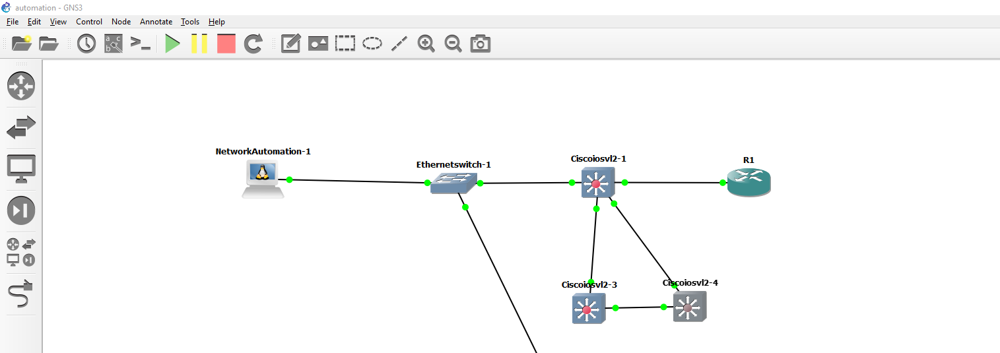
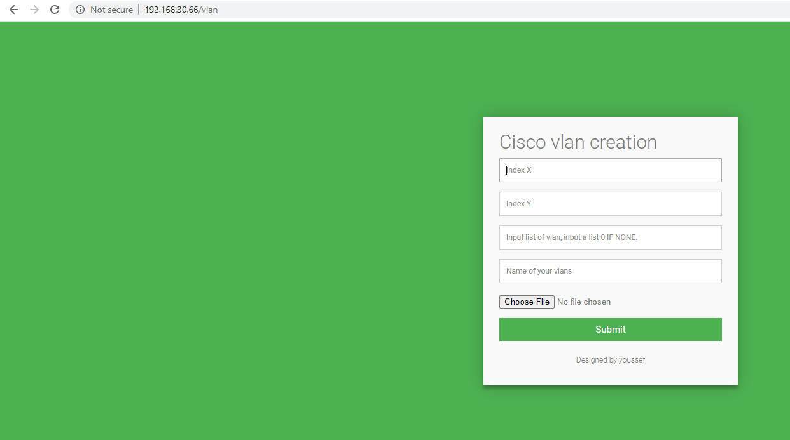

# cisco_netmiko
A SIMPLE WEB APP USING NETMIKO (cisco automation of vlan) MORE FEATURE WILL BE ADDED OF COURSE FELL FREE TO TRY IT AND CONTRIBUTE!
dict.txt is the config file 
gui.py is the app that connect with ssh, init config is needed. The app can create up to 100 per 1min vlan!
                  Vlan monitoring In Progress... 

